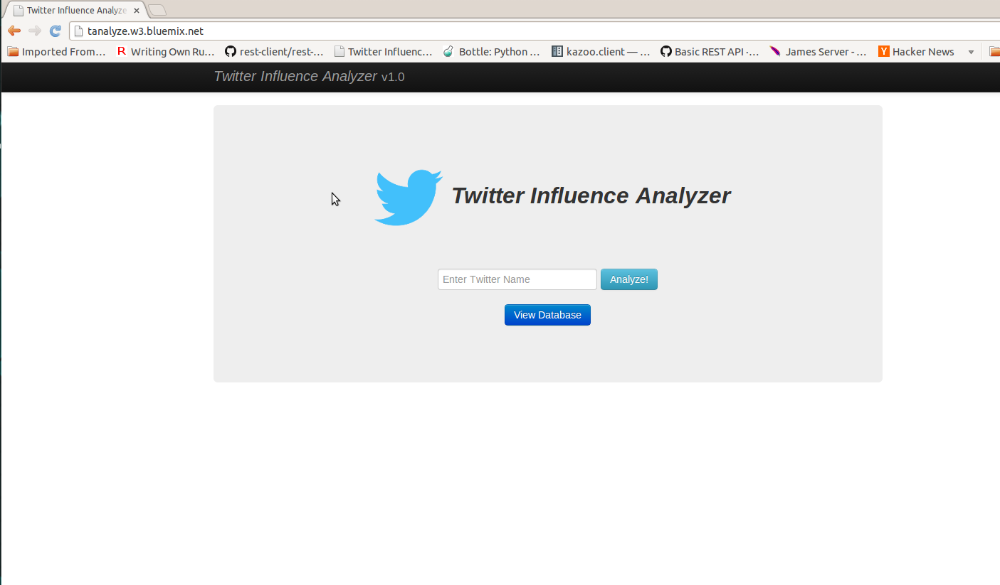
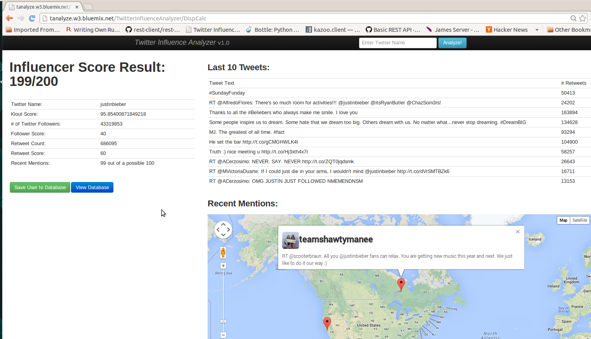
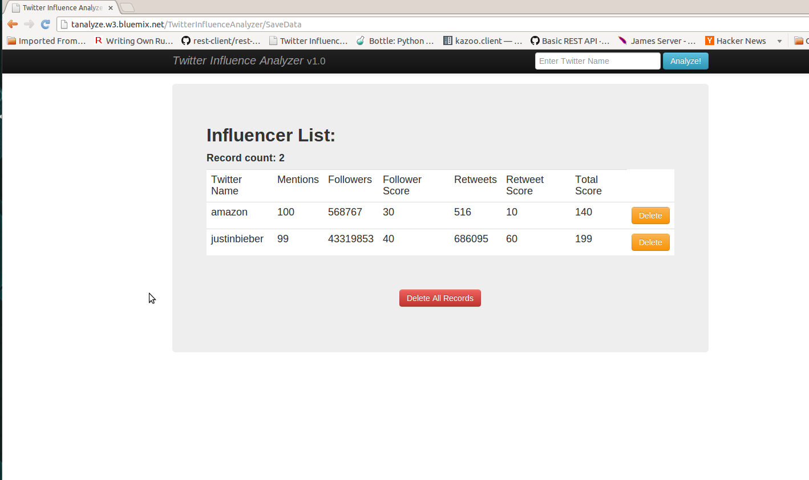

# How to Run and Deploy the Twitter Influence Analyzer #

## Overview of the app ##

This is a Java app that uses the following cloud services:

-   MongoDB

## License ##
Licensed under the Apache License, Version 2.0 (the "License"); you may not use this file except in compliance with the License. You may obtain a copy of the License at

     http://www.apache.org/licenses/LICENSE-2.0

Unless required by applicable law or agreed to in writing, software distributed under the License is distributed on an "AS IS" BASIS, WITHOUT WARRANTIES OR CONDITIONS OF ANY KIND, either express or implied. See the License for the specific language governing permissions and limitations under the License.
        
## Pushing the app using Eclipse ##

### Step 1: Prerequisites ###

#### • Download Source ####

The source for this app is at GitHub so, you can either download the zip file or clone the repository from the command line.

| Download Zip | [`https://github.com/ibmjstart/bluemix-java-sample-twitter-influence-app/archive/master.zip`](https://github.com/ibmjstart/bluemix-java-sample-twitter-influence-app/archive/master.zip) |
|-----------|----------------------------------------------------------------------------------------|
| Git Clone:| `git clone https://github.com/ibmjstart/bluemix-java-sample-twitter-influence-app.git` |

#### • Download Cloud Foundry Plug-in ####

You will also need to download the Cloud Foundry plug-in for Eclipse.  To do this, go to Eclipse and follow the instructions below:

  1. Click: Help > Eclipse Marketplace...
  2. Search: "Cloud Foundry"
  3. Look for the item titled: "Cloud Foundry Integration for Eclipse x.x.x" (It should be the first listing)
  4. Click: Install
    

### Step 2. Import the project into Eclipse ###
		
Next, you will need to import the project into [**Eclipse**](https://www.eclipse.org/downloads/).  There are two ways you can get the source into Eclipse:

Option A. Import the Eclipse project by following these instructions:
  1. Start by cloning the repository, as described above
  2. Open Eclipse
  3. Select File->Import
  4. Under the header labeled "General", click "Existing Projects Into Workspace" and click Next
  5. Click "Browse" next to the first text field, and navigate to the cloned repository and find the folder labeled "app" and click ok.
  6. Under Projects you should now see a project called "twitter_influence_analyzer", make sure the checkbox next to the "twitter_influence_analyzer" project is checked and then click Finish
  7. You should now see the "twitter_influence_analyzer" project in your list of projects in Eclipse.

 -OR-
 
Option B. Import the WAR File
  1. Navigate to https://github.com/ibmjstart/bluemix-java-sample-twitter-influence-app/releases
  2. Click the green button labeled "twitter_influence_analyzer.war" and that will download the WAR file.
  3. Open Eclipse
  4. Then File->Import
  5. Scroll down to the "Web" section, expand that section and click WAR File then click Next.
  6. Click next and then Finish and the project should be imported into Eclipse

### Step 3. Acquiring External and Public APIs ###

This app uses some external APIs. You need to register the app with Twitter and Klout to get the keys and tokens.

#### • Twitter v1.1 API ####

To access the Twitter API you need the consumer keys and access tokens, so you must register the app with Twitter. You can register your app [here](https://dev.twitter.com/).

[More information on how to register the app with Twitter](registerTwitter.md)

#### • Klout API ####

You can register the app with Klout [here](http://developer.klout.com/member/). When you register with Klout, you'll get a Klout Key, which you can use to create a Klout Object as shown in the code.

#### • Google Maps v3 API ####

This app uses the Google Maps v3 APIs. Google APIs are open for the developers and you do not need to register the app with Google. Here's the [link](https://developers.google.com/maps/documentation/javascript/tutorial) for the Google Maps APIs.

### Step 4. Configuring the Project Files###

There are two files that need to be edited.  You can do this directly in Eclipse or using your favorite text editor.

|                    Filenames                 |                              Path                               |
|----------------------------------------------|-----------------------------------------------------------------|
| `twitter4j.properties` `klout.properties` | Local: `.../bluemix-java-sample-twitter-influence-app/app/src/` |
| `twitter4j.properties` `klout.properties` | Eclipse: `Project_Name > Java Resources > src`                  |            

The twitter credentials are entered in the file called `twitter4j.properties`. Simply copy and paste the credentials from your new app on twitter into the appropriate categories in the file. Additionally, the Klout API key is entered in the file called `klout.properties`.

### Step 5. Deploying the app ###

#### • Set up Bluemix Server ####

Make sure you are in the Java EE [perspective](http://help.eclipse.org/juno/index.jsp?topic=%2Forg.eclipse.platform.doc.user%2Fconcepts%2Fconcepts-4.htm) in Eclipse.  

  1. In the bottom window section, select the **Servers** tab.  (Alternatively, you can click: `Window > Show View > Servers`)
  2. Right-Click inside the Servers panel and select `New > Server`
  3. Select, `Pivotal > Cloud Foundry` and click Next.
  4. Click Manage Cloud, then click Add
  5. Enter: `Bluemix` as the name, and `https://api.ng.bluemix.net` as the URL
  6. Click Finish, then click, OK
  7. Enter your login information for Bluemix in the email and password sections.
  8. From the URL dropdown menu, choose: Bluemix
  9. Click: Validate Account
  10. Click: Finish

#### • Push the app ####
  1. Right-Click on the Bluemix server and click: `Connect`
  2. Right-Click on the Bluemix server and select: `Add and Remove...`
  3. Select your Twitter Influence Analyzer project from the window on the left and click: `Add >`
  4. Click: `Finish`
  5. Enter a Name and select: Next
  6. Enter a UNIQUE hostname and click: Finish

**CONGRATS!**  Your app is now published to Bluemix.  
(Note: It can take a few minutes to upload everything and deploy all of the services.)

### Step 6. Explore your app ####

  1. In your web browser, go to: [https://ace.ng.bluemix.net](https://ace.ng.bluemix.net)
  2. Login and find your new app on the Dashboard.
  3. Below the name of your app is a link that takes you to the running app.  Click on that link.

## Screenshots ##

This is the home screen of the app. You can enter a twitter screen name in the text box and click the Analyze button to see their influence. You can also view any records saved in the database by clicking on the 'View Database' button.

After entering the twitter name and clicking the Analyze button, you'll be able to see the influence analysis of that person on the left side. You will also see their last 10 tweets and any recent mentions in the tweets plotted on Google Maps (if there is geolocation data for a tweet).

These are the records of the Influencers in the database. The user can also delete the records.

