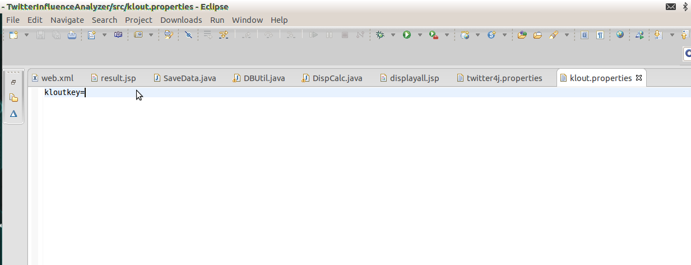
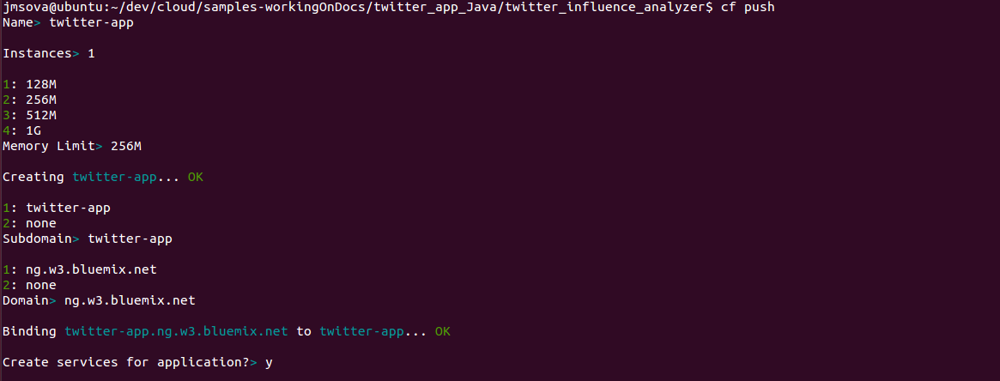
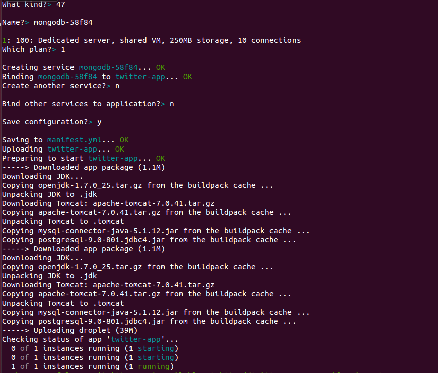

# How to Run and Deploy the Twitter Influence Analyzer #

## Overview of the app ##

This is a Java app that uses the following cloud services:

-   Company Text Analytics Service

## Prerequisites ##

Before we begin, we first need to install the command line tool that will be used to upload and manage your application. Cloud Foundry uses a tool called [**cf**](https://github.com/cloudfoundry/cf). This tool is written in Ruby, so you must have Ruby installed. If you are running on Windows, you can install Ruby from [this](http://rubyinstaller.org/downloads/) website. 

For Linux systems, consult your documentation for how to install the **ruby** package - for Ubuntu the command:

		apt-get install ruby

should work for you.

Once Ruby is installed, cf can be installed by using the **gem install** command:
        
		gem install cf
        
## Download the App ##

The source for this app is at GitHub so, for example, if you are using the command line you can clone the repository like this:

		git clone https://github.com/ibmjstart/bluemix-java-sample-twitter-influence-app.git
		
If you want to use Eclipse to work on it, there are two ways you can get the source into Eclipse:

Option A. Import the Eclipse project by following these instructions:
  1. Start by cloning the repository, as described above
  2. Open Eclipse
  3. Select File->Import
  4. Under the header labeled "General", click "Existing Projects Into Workspace" and click Next
  5. Click "Browse" next to the first text field, and navigate to the cloned repository and find the folder labeled "app" and click ok.
  6. Under Projects you should now see a project called "twitter_influence_analyzer", make sure the checkbox next to the "twitter_influence_analyzer" project is checked and then click Finish
  7. You should now see the "twitter_influence_analyzer" project in your list of projects in Eclipse.

 -OR-
 
Option B. Import the WAR File
  1. Navigate to https://github.com/ibmjstart/bluemix-java-sample-twitter-influence-app/releases
  2. Click the green button labeled "twitter_influence_analyzer.war" and that will download the WAR file.
  3. Open Eclipse
  4. Then File->Import
  5. Scroll down to the "Web" section, expand that section and click WAR File then click Next.
  6. Click next and then Finish and the project should be imported into Eclipse

## External and Public APIs ##

This app uses some external APIs. You need to register the app with Twitter and Klout to get the keys and tokens.

### Twitter v1.1 API ###

To access the Twitter API you need the consumer keys and access tokens, so you must register the app with Twitter. You can register your app [here](https://dev.twitter.com/).

[More information on how to register the app with Twitter](registerTwitter.md)

### Klout API ###

You can register the app with Klout [here](http://developer.klout.com/member/). When you register with Klout, you'll get a Klout Key, which you can use to create a Klout Object as shown in the code.

### Google Maps v3 API ###

This app uses the Google Maps v3 APIs. Google APIs are open for the developers and you do not need to register the app with Google. Here's the [link](https://developers.google.com/maps/documentation/javascript/tutorial) for the Google Maps APIs.

The twitter credentials are entered in the file called as twitter4j.properties which is present in the classpath (src directory). Just copy paste the credentials in twitter4j.properties file that you get after registering the app with twitter. Also the Klout API key is entered in the file called klout.properties present in the classpath as shown below:

## Deploying the App ##

Once you have included the Twitter keys and tokens and Klout key as shown above, you are all set to deploy the app. In the terminal, go in the directory of the app. The application is wrapped in a WAR file. You can directly deploy/push the WAR file using push command:

		cf push

Just follow the instructions on the screen. You can select the default settings for deploying the app, i.e. for URL, memory reservations (512 Recommended), number of instances. You need to bind the MongoDB service to the app.

### Binding a Service to Your App ###

For the app to function correctly, you must create the service instance and bind the service instance while deploying the app. The **cf push** command will ask, "Create services for application?" Answer yes, then you will be presented with a list of services. Choose **mongodb** from this list. Below, you can see some screenshots of what this should look like when deploying from the command line.

-   After the application is deployed using **cf push**, you can check the status of the app using the following command: **cf apps**. If the status is RUNNING, you can hit the URL in the browser and see the application is running.

## Troubleshooting ##

-   Sometimes your app may not work as expected and debugging needs to be done. The cf command line tool can be used to assist with debugging. With the cf you can check your app's logs by typing the command **cf logs [app_name]** 
-   When you first start using the cf tool, you may potentially have trouble logging in due to no target being set. To view the target that is set, type **cf target** and if you want to set a new target type **cf target [target_url]**. Note: The target URL will usually be in the form of http://api.xxx.tld
-   From time to time your app may stop working, this means it could require a restart. To do this you must first stop it by typing **cf stop**. Once the app has been stopped, you can type **cf start** and if there are no other problems your app should start. 

## Screenshots ##

This is the home screen of the app. You can enter a twitter screen name in the text box and click the Analyze button to see their influence. You can also view any records saved in the database by clicking on the 'View Database' button.

After entering the twitter name and clicking the Analyze button, you'll be able to see the influence analysis of that person on the left side. You will also see their last 10 tweets and any recent mentions in the tweets plotted on Google Maps (if there is geolocation data for a tweet).

These are the records of the Influencers in the database. The user can also delete the records.

